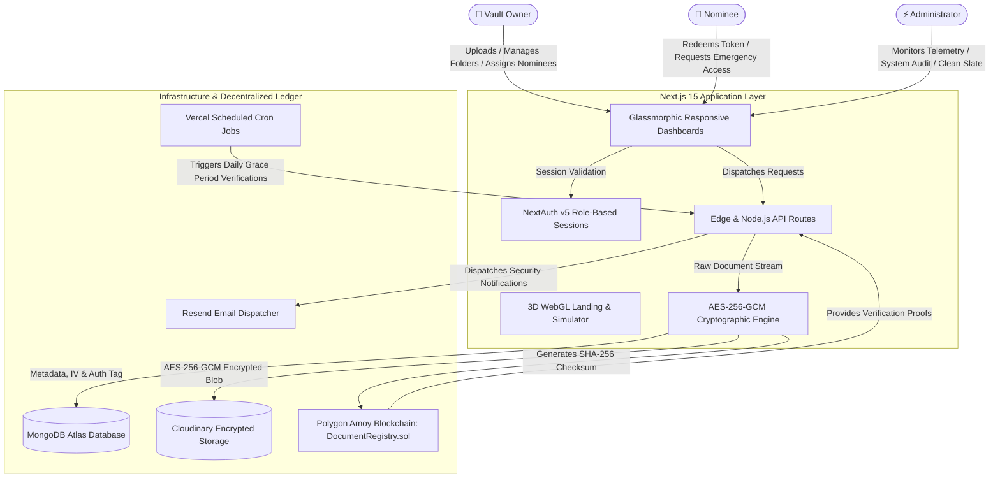

<div align="center">

# 🛡️ Digital Legacy & Emergency Access Vault

[](https://digilecacy.vercel.app/)
[](https://nextjs.org/)
[](https://react.dev/)
[](https://www.typescriptlang.org/)
[](https://threejs.org/)
[-8247E5?style=for-the-badge&logo=polygon)](https://polygon.technology/)
[](https://tailwindcss.com/)
[](https://www.mongodb.com/)
[](https://opensource.org/licenses/MIT)

**An enterprise-grade, zero-knowledge digital legacy and emergency access vault designed to safeguard critical assets, private documents, and credentials, ensuring cryptographically verifiable transfer to trusted nominees during emergencies or incapacitation.**

[🌐 Live Deployment](https://digilecacy.vercel.app/) • [✨ Features](#-key-features) • [🛠️ Architecture](#%EF%B8%8F-system-architecture) • [🔐 Security & Cryptography](#-cryptographic-lifecycle--security) • [⛓️ Smart Contract](#%EF%B8%8F-smart-contract-documentregistry) • [🚀 Getting Started](#-getting-started) • [📡 API Reference](#-api-reference)

---
</div>

## 🌟 Live Demo

The production application is live and deployed on Vercel with Polygon Amoy integration:
👉 **[https://digilecacy.vercel.app](https://digilecacy.vercel.app)**

---

## 📖 Overview

In modern digital life, essential assets—wills, legal agreements, financial records, crypto keys, recovery codes, and sentimental memories—are scattered across devices and cloud providers. If an unexpected crisis or incapacitation occurs, loved ones and business partners are often locked out indefinitely.

**Digital Legacy Vault** solves this with a trust-minimized, multi-layered architecture:
1. **Zero-Knowledge Server-Side Encryption (AES-256-GCM)** ensures documents are never stored or transferred in plaintext.
2. **Decentralized Hash Anchoring (Polygon Amoy)** anchors cryptographic checksums on-chain to guarantee file integrity and prevent stealth tampering.
3. **Automated Dead-Man's Switch (Vercel Cron & Resend)** initiates a customizable waiting period when a nominee requests access, sending multi-channel alert emails to the owner and auto-clearing access if the owner fails to respond.
4. **Interactive 3D WebGL Interface (Three.js)** delivers a futuristic, cyber-secure experience with real-time cryptographic simulations.

---

## ✨ Key Features

### 🌐 1. Interactive 3D WebGL & Cyberpunk Aesthetics
* **Real-Time 3D Cryptographic Vault**: Dynamic Three.js canvas featuring floating cryptographic polyhedrons, orbital wireframes, dynamic lighting, and mouse-parallax responsiveness.
* **Interactive Vault Simulator**: Live sandbox on the landing page where prospective users test client encryption, SHA-256 generation, and mock blockchain verification before registering.
* **Story Scroll Experience**: Seamless journey-driven scroll presentation highlighting legacy inheritance phases.
* **Glassmorphic Cyber-Design**: Neon cyan/violet gradients, backdrop blurs, fluid micro-interactions, and accessible high-contrast typography.

### 🔐 2. Zero-Knowledge Server-Side Encryption
* **AES-256-GCM Symmetric Cipher**: Every file is encrypted using an isolated 96-bit initialization vector (IV) and verified via a 128-bit authentication tag before persistence.
* **Encrypted Cloud Storage**: Raw bytes are uploaded as encrypted ciphertext to Cloudinary. The database holds only encrypted URLs, IVs, and auth tags.
* **Ephemeral In-Memory Decryption**: Files are decrypted directly into temporary in-memory streams only upon verified requests by authorized owners or cleared nominees.

### ⛓️ 3. Polygon Amoy Blockchain Hash Anchoring
* **Immutable Document Checksums**: Calculates a SHA-256 checksum of the original unencrypted document and anchors it on the **Polygon Amoy Testnet** (`DocumentRegistry.sol`).
* **Instant Hash Verification**: Nominees and owners can verify any stored document against the on-chain ledger in real time to verify that it has remained untouched.
* **On-Chain Event Logging**: Smart contract emits events (`DocumentRegistered`, `DocumentVerified`, `EmergencyApproved`) to create an immutable audit trail.

### 👥 4. Three Dedicated Persona Portals
* **👑 Vault Owner Portal**:
  * Upload, organize, tag, and categorize documents in a hierarchical folder tree.
  * Delegate designated nominees with customizable grace/waiting periods (e.g., 7, 15, 30 days).
  * Review, approve, or reject pending emergency access requests in real time.
  * Full activity audit feed and storage quota analytics.
* **🤝 Nominee Emergency Portal**:
  * Role-isolated dashboard with redemption token activation.
  * File emergency access requests with stated reasons and urgency documentation.
  * Live countdown timers tracking auto-clearance deadlines.
  * Decrypt and download unlocked assets alongside on-chain verification certificates.
* **⚡ Administrator Control Plane**:
  * Real-time metrics: total vaults, documents stored, encrypted storage breakdown, nominee distributions.
  * System-wide audit logs with IP tracking and timestamping.
  * User account status inspection and administrative role management.
  * **Clean-Slate Reset Tool**: Built-in developer utility to reset testbeds and wipe demo data on demand.

### 🚨 5. Dead-Man's Switch & Automated Clearance
* **Automated Clearance Execution**: If an owner becomes unresponsive or incapacitated, scheduled Vercel Cron jobs automatically clear nominee requests upon grace period expiration.
* **Multi-Stage Email Alerts**: Automated emails powered by the Resend API alert owners of emergency access requests, grace period countdowns, and final clearance warnings.

---

## 🛠️ System Architecture



---

## 💻 Tech Stack

| Domain | Technologies | Details & Role |
|---|---|---|
| **Core Framework** | [Next.js 15.5](https://nextjs.org/) | App Router, Server Actions, Route Handlers, Turbopack |
| **Frontend UI** | [React 19.1](https://react.dev/), [TypeScript 5](https://www.typescriptlang.org/) | Type-safe UI components, client state management |
| **Styling** | [Tailwind CSS 4](https://tailwindcss.com/) | Modern high-performance styling, glassmorphic UI |
| **3D & Visuals** | [Three.js](https://threejs.org/), [Framer Motion 12](https://www.framer.com/motion) | Interactive 3D scene, floating meshes, dynamic viewport transitions |
| **Icons & Design** | [Lucide React](https://lucide.dev/), [Radix UI](https://www.radix-ui.com/) | Accessible component primitives and iconography |
| **Authentication** | [NextAuth.js v5](https://authjs.dev/) | Role-based JWT session authentication (`owner`, `nominee`, `admin`) |
| **Database** | [MongoDB Atlas](https://www.mongodb.com/atlas) with [Mongoose 9](https://mongoosejs.com/) | Metadata, folder trees, access policies, audit trails |
| **Blob Storage** | [Cloudinary](https://cloudinary.com/) | Storage for encrypted document blobs (AES-256-GCM) |
| **Blockchain** | [Polygon Amoy Testnet](https://polygon.technology/) | Solidity 0.8.20, Hardhat, Ethers.js v6 |
| **Email Service** | [Resend](https://resend.com/) | Transactional security alerts and emergency notices |
| **Scheduled Tasks** | [Vercel Cron](https://vercel.com/docs/cron-jobs) | Automated dead-man's switch evaluation |

---

## 🔐 Cryptographic Lifecycle & Security

```
[Raw Document] 
       │
       ├───► SHA-256 Hash Computation ─────────────► Polygon Amoy Smart Contract
       │
       ▼
[AES-256-GCM Engine] ◄─── 32-Byte Secret Key + 96-Bit Random IV
       │
       ├───► Encrypted Ciphertext Blob ─────────────► Cloudinary Cloud Storage
       │
       └───► IV + Auth Tag + Metadata ──────────────► MongoDB Atlas
```

### Encryption Protocol
1. **Pre-Encryption Hashing**: A SHA-256 checksum of the original unencrypted document is computed.
2. **Authenticated Cipher**: The file is encrypted server-side with `AES-256-GCM` using a 256-bit secret key, a fresh cryptographically random 96-bit initialization vector (IV), and a 128-bit authentication tag.
3. **Storage Isolation**: Only the ciphertext blob is sent to Cloudinary. The encryption key never leaves the environment variables.
4. **On-Chain Anchor**: The original SHA-256 hash is registered on the Polygon Amoy blockchain via `DocumentRegistry.sol`.
5. **Decryption & Verification**: When an authorized user or cleared nominee downloads the file:
   - The ciphertext blob is pulled from Cloudinary into memory.
   - The stream is decrypted using the stored IV, authentication tag, and server key.
   - The resulting unencrypted buffer's SHA-256 hash is computed and verified against the on-chain blockchain record before delivery.

---

## ⛓️ Smart Contract: `DocumentRegistry`

The [`contracts/DocumentRegistry.sol`](contracts/DocumentRegistry.sol) contract is deployed on the **Polygon Amoy Testnet** to guarantee document integrity and immutability:

- **Network**: Polygon Amoy Testnet
- **Chain ID**: `80002`
- **Contract Address**: [`0x8CD9DD2B3c54F04fFDdd9fA563261e125CB900aA`](https://amoy.polygonscan.com/address/0x8CD9DD2B3c54F04fFDdd9fA563261e125CB900aA)
- **Solidity Version**: `^0.8.20`

### Contract Interface

```solidity
// SPDX-License-Identifier: MIT
pragma solidity ^0.8.20;

contract DocumentRegistry {
    struct DocumentRecord {
        string  documentId;
        string  ownerId;
        string  sha256Hash;
        uint256 timestamp;
        bool    exists;
    }

    // Registers document SHA-256 hash on-chain
    function registerDocument(
        string memory documentId,
        string memory ownerId,
        string memory sha256Hash
    ) external;

    // Compares provided SHA-256 hash against on-chain anchor
    function verifyDocument(
        string memory documentId,
        string memory sha256Hash
    ) external returns (bool isValid);

    // Logs emergency approval events for public auditability
    function logEmergencyApproval(
        string memory requestId,
        string memory nomineeId,
        string memory ownerId
    ) external;

    // View-only accessor for document metadata
    function getDocumentRecord(string memory documentId)
        external
        view
        returns (
            string memory storedDocumentId,
            string memory storedOwnerId,
            string memory storedHash,
            uint256       storedTimestamp
        );
}
```

---

## 📁 Repository Structure

```
├── .agents/                    # Workspace agent guidelines & rules
├── app/                        # Next.js 15 App Router
│   ├── admin/                  # Administrator Control Plane (analytics, logs, users)
│   ├── api/                    # Secure Next.js API route handlers
│   │   ├── admin/              # Admin analytics, logs, user management, clean-slate
│   │   ├── audit/              # User-facing audit log retrieval
│   │   ├── auth/               # Credentials registration, login, password recovery
│   │   ├── blockchain/         # On-chain hash verification API
│   │   ├── cron/               # Vercel Cron endpoints (auto-approve, warnings)
│   │   ├── documents/          # Upload, download, decryption, verify, delete
│   │   ├── emergency/          # Emergency access request, approve, reject
│   │   ├── folders/            # Folder management hierarchy
│   │   ├── nominees/           # Nominee delegation, invitation tokens, permissions
│   │   └── notifications/      # In-app notifications
│   ├── auth/                   # Public authentication pages (login, register, forgot-password)
│   ├── nominee/                # Nominee portal pages (dashboard, documents, owners, requests)
│   ├── owner/                  # Vault owner portal (dashboard, documents, folders, nominees, requests)
│   ├── page.tsx                # Interactive 3D WebGL landing page & simulator
│   └── layout.tsx              # Root HTML shell, providers, and global 3D atmosphere
├── components/                 # Reusable React 19 components
│   ├── blockchain/             # Verification badges, live hash verifier modals
│   ├── dashboard/              # Storage usage rings, activity feeds, metrics cards
│   ├── documents/              # File upload modal, document cards, category filters
│   ├── folders/                # Folder tree navigator and folder cards
│   ├── landing/                # Three.js 3D scene, interactive simulator, scroll journey
│   ├── nominees/               # Nominee cards, permissions management drawer
│   └── shared/                 # Role-based sidebars, notification bells, 3D particles
├── contracts/                  # Solidity smart contracts & Hardhat tooling
│   ├── scripts/                # Hardhat deployment scripts
│   ├── DocumentRegistry.sol    # Core smart contract
│   └── deployment.json         # Deployed address, chainId, and compiled ABI
├── lib/                        # Shared utility libraries
│   ├── auth.ts                 # NextAuth credentials authentication & password hashing
│   ├── blockchain.ts           # Ethers.js integration for Polygon Amoy
│   ├── cloudinary.ts           # Cloudinary SDK file uploader & fetcher
│   ├── encryption.ts           # AES-256-GCM encryption/decryption routines
│   ├── mongodb.ts              # MongoDB Atlas connection manager & caching
│   └── resend.ts               # Transactional email notification service
├── models/                     # Mongoose schemas & data models
│   ├── AuditLog.ts             # Immutable user action log
│   ├── Document.ts             # File metadata, encrypted URL, IV, auth tag, hash
│   ├── EmergencyRequest.ts     # Request state, waiting period, justification
│   ├── Folder.ts               # Hierarchical folder structure
│   ├── Nominee.ts              # Nominee delegation, permissions, access tokens
│   └── User.ts                 # User identity, roles (owner, nominee, admin)
├── scripts/                    # Maintenance & reset scripts
│   └── clean-slate.ts          # CLI script to wipe test collections
├── vercel.json                 # Vercel deployment configuration & cron schedules
├── hardhat.config.js           # Hardhat configuration for Polygon Amoy & local networks
└── package.json                # Project dependencies and npm scripts
```

---

## 📡 API Reference

| Endpoint | Method | Role | Description |
|---|---|---|---|
| `/api/auth/register` | `POST` | Public | Register a new account (`owner` or `nominee`) |
| `/api/auth/forgot-password` | `POST` | Public | Send password reset token to user email |
| `/api/documents` | `GET` / `POST` | Owner | List or create document metadata |
| `/api/documents/upload` | `POST` | Owner | Encrypt with AES-256-GCM, upload to Cloudinary, anchor hash on Polygon |
| `/api/documents/[id]` | `GET` / `DELETE` | Owner / Nominee | Fetch document metadata or delete document |
| `/api/documents/[id]/download` | `GET` | Owner / Cleared Nominee | In-memory stream decryption and file download |
| `/api/documents/[id]/verify` | `GET` | Owner / Cleared Nominee | Verify file SHA-256 integrity against Polygon Amoy |
| `/api/folders` | `GET` / `POST` | Owner | List folder hierarchy or create nested folder |
| `/api/nominees` | `GET` / `POST` | Owner | List assigned nominees or invite a new nominee |
| `/api/nominees/[id]` | `PUT` / `DELETE` | Owner | Update waiting period / permissions or revoke nominee |
| `/api/nominees/owners` | `GET` | Nominee | List vault owners who assigned the authenticated nominee |
| `/api/nominees/documents` | `GET` | Nominee | List unlocked documents accessible to the nominee |
| `/api/nominees/redeem` | `POST` | Nominee | Redeem an invitation token from an owner |
| `/api/emergency/request` | `POST` | Nominee | Submit an emergency access request with reason |
| `/api/emergency/[id]/approve` | `POST` | Owner | Approve pending emergency request and grant access |
| `/api/emergency/[id]/reject` | `POST` | Owner | Deny pending emergency request |
| `/api/blockchain/verify` | `POST` | Authenticated | Standalone on-chain document hash verification |
| `/api/notifications` | `GET` / `PATCH` | Authenticated | Fetch notifications or mark as read |
| `/api/audit` | `GET` | Owner | Fetch user-specific security audit trail |
| `/api/admin/analytics` | `GET` | Admin | Retrieve platform-wide telemetry and storage metrics |
| `/api/admin/users` | `GET` / `PATCH` / `DELETE` | Admin | Search users, toggle status, update roles, delete accounts |
| `/api/admin/logs` | `GET` | Admin | Platform-wide audit log stream |
| `/api/admin/clean-slate` | `GET` / `POST` | Admin / Secret | Reset database testbed (`?secret=clean_vault_slate`) |
| `/api/cron/auto-approve` | `GET` | Vercel Cron | Evaluate expired grace periods and auto-clear nominees |
| `/api/cron/warn-auto-approve` | `GET` | Vercel Cron | Send reminder emails to owners approaching grace deadlines |

---

## 🚀 Getting Started

### Prerequisites

Make sure you have installed:
* **Node.js** (v18.18.0 or higher)
* **npm** (v9 or higher)
* **MongoDB** connection string (MongoDB Atlas or local instance)
* **Cloudinary** account credentials for encrypted blob storage
* **Resend** API key for transactional emails
* **Polygon Amoy** wallet with test MATIC (faucet available at [faucet.polygon.technology](https://faucet.polygon.technology/))

---

### 1. Clone & Install

```bash
git clone https://github.com/Dharani94873/Digital-Legacy-and-Emergency-Access-Vault.git
cd Digital-Legacy-and-Emergency-Access-Vault
npm install
```

---

### 2. Configure Environment Variables

Create a `.env` file in the project root based on `.env.example`:

```env
# ----------------------------------------------------
# DATABASE & AUTHENTICATION
# ----------------------------------------------------
MONGODB_URI=mongodb+srv://<username>:<password>@cluster.mongodb.net/vault?retryWrites=true&w=majority
NEXTAUTH_SECRET=your_super_secret_key_minimum_32_characters_long
NEXTAUTH_URL=http://localhost:3000

# ----------------------------------------------------
# ZERO-KNOWLEDGE SERVER-SIDE ENCRYPTION
# Must be exactly 32 bytes represented as 64 hex characters:
# e.g., generate with: node -e "console.log(crypto.randomBytes(32).toString('hex'))"
# ----------------------------------------------------
ENCRYPTION_KEY=0123456789abcdef0123456789abcdef0123456789abcdef0123456789abcdef

# ----------------------------------------------------
# CLOUDINARY ENCRYPTED BLOB STORAGE
# ----------------------------------------------------
CLOUDINARY_URL=cloudinary://<api_key>:<api_secret>@<cloud_name>

# ----------------------------------------------------
# EMAIL NOTIFICATIONS (RESEND)
# ----------------------------------------------------
RESEND_API_KEY=re_your_resend_api_key
FROM_EMAIL=noreply@digitalvault.app

# ----------------------------------------------------
# POLYGON AMOY SMART CONTRACT & WALLET
# ----------------------------------------------------
POLYGON_AMOY_RPC_URL=https://rpc-amoy.polygon.technology
DEPLOYER_PRIVATE_KEY=your_deployer_wallet_private_key
CONTRACT_ADDRESS=0x8CD9DD2B3c54F04fFDdd9fA563261e125CB900aA

# ----------------------------------------------------
# VERCEL CRON SECURITY
# ----------------------------------------------------
CRON_SECRET=your_secure_cron_token_for_endpoint_protection
```

---

### 3. Smart Contract Deployment (Optional)

A live contract is already deployed on Polygon Amoy at `0x8CD9DD2B3c54F04fFDdd9fA563261e125CB900aA`. If you wish to deploy your own instance:

```bash
# Compile contracts
npm run contract:compile

# Deploy to Polygon Amoy Testnet
npm run contract:deploy
```

The script automatically records the deployed address and ABI to `contracts/deployment.json`.

---

### 4. Run the Development Server

```bash
npm run dev
```

Open [http://localhost:3000](http://localhost:3000) in your browser.

---

## 📜 Available NPM Scripts

| Command | Description |
|---|---|
| `npm run dev` | Launches the Next.js local development server with Turbopack |
| `npm run build` | Compiles the production build for Vercel deployment |
| `npm run start` | Runs the compiled production server |
| `npm run type-check` | Runs the mandatory TypeScript compiler check (`tsc --noEmit`) |
| `npm run lint` | Runs ESLint 9 checks |
| `npm run contract:compile` | Compiles Solidity contracts using Hardhat |
| `npm run contract:deploy` | Deploys `DocumentRegistry.sol` to Polygon Amoy testnet |
| `npm run contract:deploy:local` | Deploys `DocumentRegistry.sol` to a local Hardhat node |
| `npm run db:clean` | CLI tool to wipe all MongoDB collections for a clean test state |

---

## 🧪 Testing & Clean-Slate Reset

For demonstration, QA, and testing purposes:

1. **Wipe Database via CLI**:
   ```bash
   npm run db:clean
   ```
2. **Wipe Database via HTTP API**:
   Make a request to the Clean-Slate endpoint:
   ```bash
   curl "http://localhost:3000/api/admin/clean-slate?secret=clean_vault_slate"
   ```
3. **Multi-Role Test Flow**:
   - Register a **Vault Owner** at `/auth/register` (Role: Owner).
   - Upload sensitive documents and organize them in folders.
   - Assign a **Nominee** by email with a test waiting period.
   - Register the **Nominee** account at `/auth/register` (Role: Nominee).
   - Submit an emergency access request from `/nominee/requests`.
   - Log back in as the Owner to review and approve, or simulate auto-clearance via `/api/cron/auto-approve`.

---

## 🛡️ Security Considerations

> [!IMPORTANT]
> **Zero Plaintext Storage**: Raw files are never written to disk unencrypted or stored in plain form. All symmetric operations use AES-256-GCM with authenticated tags to prevent ciphertext tampering.

> [!TIP]
> **Key Management**: In production deployments, store `ENCRYPTION_KEY` and `DEPLOYER_PRIVATE_KEY` in managed secrets management systems (e.g., AWS Secrets Manager, Vercel Encrypted Environment Variables) and rotate periodically.

> [!WARNING]
> This repository is designed for demonstration, educational, and reference purposes. We advise completing formal legal and smart contract audits prior to storing regulated financial, legal, or medical instruments in high-consequence production environments.

---

## 📄 License

This project is open-source and distributed under the **[MIT License](LICENSE)**.
