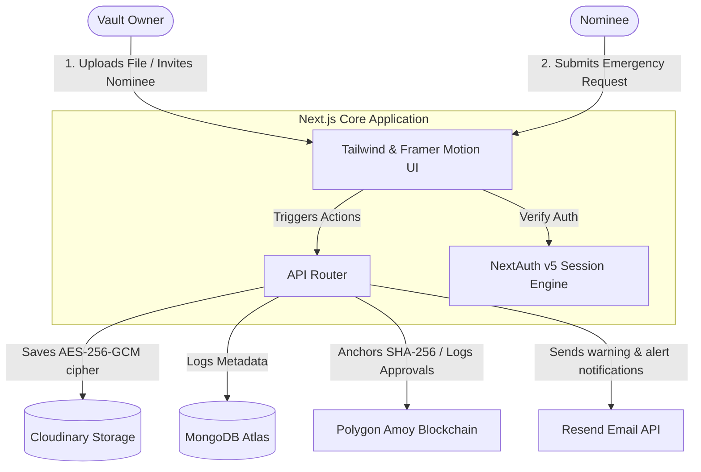

<div align="center">

# 🛡️ Digital Legacy & Emergency Access Vault

[](https://nextjs.org/)
[](https://react.dev/)
[](https://soliditylang.org/)
[](https://tailwindcss.com/)
[](https://opensource.org/licenses/MIT)

**An enterprise-grade, highly secure digital legacy vault designed to protect your most critical files and ensure they seamlessly transfer to trusted nominees during emergencies. Built with Next.js 15, AES-256-GCM encryption, and Polygon Blockchain verification.**

[Explore Features](#-key-features) • [View Architecture](#%EF%B8%8F-system-architecture) • [Getting Started](#-getting-started) • [Security Notice](#-security--integrity)

---
</div>

## ✨ Key Features

### 🔐 Zero-Knowledge Server-Side Encryption
* **AES-256-GCM Cipher**: Every uploaded document is encrypted using a unique 96-bit random IV and authentication tag before leaving the application server context.
* **Secure Blob Storage**: Encrypted files are stored on Cloudinary. The database only tracks encrypted URLs, IVs, and tags—making it impossible for unauthorized parties to view raw documents.

### ⛓️ Polygon Blockchain Verification
* **Immutable Anchoring**: Calculates a SHA-256 hash of the original document and anchors it on the **Polygon Amoy testnet** using a Solidity smart contract.
* **On-Chain Proof**: Verify files against the smart contract registry at any time, providing cryptographic proof that the document has not been tampered with.

### 👥 Dual-Role Architecture (Switcher Layout)
* **Unified Workspace**: Users can concurrently act as **Vault Owners** (uploading folders/documents, inviting nominees) and **Nominees** for other users (requesting access, viewing documents).
* **Mode Swapping**: Easily switch dashboards using a toggle sidebar.

### 🚨 Emergency Access & Dead-Man's Switch
* **Configurable Waiting Periods**: Owners specify waiting periods (e.g., 7, 15, 30 days) for nominees.
* **Vercel Cron Automation**: Overdue emergency requests automatically auto-approve if the owner is inactive or incapacitated, triggering email alerts via Resend API and recording approval hashes on-chain.

---

## 🛠️ System Architecture

The interaction flow below details how owners, nominees, databases, and blockchain nodes interface with the application:



---

## 💻 Tech Stack

* **Frontend**: Next.js 15 (App Router), React 19, Tailwind CSS, Framer Motion, Radix UI
* **Backend**: Next.js Server Actions & API Routes, NextAuth v5 (Credential Provider)
* **Database**: MongoDB Atlas, Mongoose ORM
* **Storage**: Cloudinary (Encrypted blob buckets)
* **Blockchain**: Solidity, Hardhat, Ethers.js, Polygon Amoy Testnet
* **Transactional Mailer**: Resend API

---

## 🚀 Getting Started

### Prerequisites
* Node.js (v18.0.0 or higher)
* MongoDB Atlas cluster database string
* Cloudinary API credentials
* Resend API email verification key
* Polygon Amoy RPC URL & Wallet private key (with test MATIC)

### 1. Installation
Clone the repository and install dependency bundles:
```bash
git clone https://github.com/Dharani94873/Digital-Legacy-and-Emergency-Access-Vault.git
cd Digital-Legacy-and-Emergency-Access-Vault
npm install
```

### 2. Environment Configuration
Create a `.env` file in the root directory and define the following variables:
```env
# MongoDB Database
MONGODB_URI=mongodb+srv://<username>:<password>@cluster.mongodb.net/vault?retryWrites=true&w=majority

# NextAuth Configuration
NEXTAUTH_SECRET=your_super_secret_session_key
NEXTAUTH_URL=http://localhost:3000

# Server-Side Cryptography Encryption Key (must be exactly 32 bytes/64 hex characters)
ENCRYPTION_KEY=0123456789abcdef0123456789abcdef0123456789abcdef0123456789abcdef

# Vercel Cron Key
CRON_SECRET=your_custom_cron_security_key

# Cloudinary Integration
CLOUDINARY_URL=cloudinary://<api_key>:<api_secret>@<cloud_name>

# Resend API Key
RESEND_API_KEY=re_your_secret_resend_api_key
FROM_EMAIL=noreply@digitalvault.app

# Polygon Blockchain Integration
POLYGON_AMOY_RPC_URL=https://rpc-amoy.polygon.technology
DEPLOYER_PRIVATE_KEY=your_deployer_wallet_private_key
CONTRACT_ADDRESS=your_deployed_registry_contract_address
```

### 3. Deploy Smart Contracts (Optional)
If you wish to redeploy or modify the Solidity smart contract on Polygon:
```bash
# Compile Solidity contracts
npm run contract:compile

# Deploy to Polygon Amoy Network
npm run contract:deploy
```

### 4. Run Locally
Start the Next.js development server:
```bash
npm run dev
```
Open [http://localhost:3000](http://localhost:3000) in your browser.

---

## ⛓️ Smart Contract: `DocumentRegistry`

The smart contract [`DocumentRegistry.sol`](contracts/DocumentRegistry.sol) serves as the ledger of truth.

```solidity
contract DocumentRegistry {
    // Registers SHA-256 hash of documents on-chain
    function registerDocument(string memory documentId, string memory ownerId, string memory sha256Hash) external;
    
    // Validates if a document matches the on-chain recorded hash
    function verifyDocument(string memory documentId, string memory sha256Hash) external returns (bool isValid);
    
    // Emits verification and log approval events for auditing
    function logEmergencyApproval(string memory requestId, string memory nomineeId, string memory ownerId) external;
}
```

---

## 🛡️ Security & Integrity

> [!WARNING]
> This application is built for demonstration and educational purposes. While it incorporates enterprise-grade AES-256-GCM encryption and Polygon blockchain verification, we highly recommend conducting a formal cryptographic and security audit before deploying it to store sensitive legal or medical information in a production environment.

---

## 📄 License
This project is licensed under the MIT License - see the [LICENSE](LICENSE) file for details.
