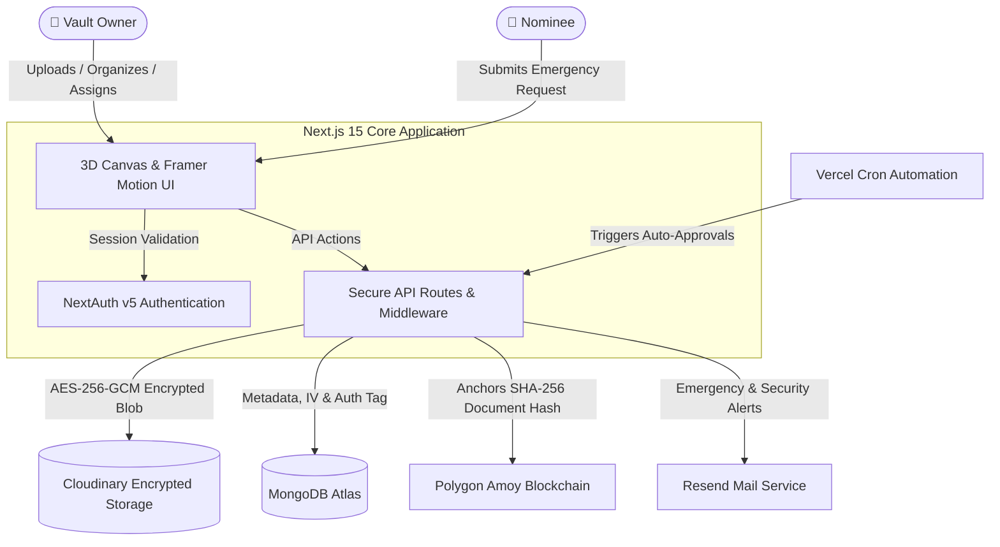

<div align="center">

# 🛡️ Digital Legacy & Emergency Access Vault

[](https://digilecacy.vercel.app/)
[](https://nextjs.org/)
[](https://react.dev/)
[](https://www.typescriptlang.org/)
[](https://threejs.org/)
[](https://polygon.technology/)
[](https://tailwindcss.com/)
[](https://opensource.org/licenses/MIT)

**An enterprise-grade, highly secure digital legacy vault built to protect your most sensitive documents and seamlessly transfer them to designated nominees during emergencies. Powered by Next.js 15, AES-256-GCM encryption, Polygon Blockchain verification, and an interactive 3D interface.**

[🌐 Live Deployment](https://digilecacy.vercel.app/) • [✨ Features](#-key-features) • [🛠️ Architecture](#%EF%B8%8F-system-architecture) • [🚀 Getting Started](#-getting-started) • [⛓️ Smart Contract](#%EF%B8%8F-smart-contract-documentregistry) • [🛡️ Security](#-security--integrity)

---
</div>

## 🌟 Live Demo

The application is deployed on Vercel:
👉 **[https://digilecacy.vercel.app](https://digilecacy.vercel.app)**

---

## ✨ Key Features

### 🌐 Modern 3D & Cyberpunk Aesthetics
* **Interactive 3D Canvas**: Real-time Three.js geometric wireframes and floating cryptographic meshes that respond to mouse movements and dynamic scroll behavior.
* **Premium Glassmorphic UI**: Ultra-refined dark-mode aesthetic with radiant neon gradients, micro-animations, and fluid transitions.

### 🔐 Zero-Knowledge Server-Side Encryption
* **AES-256-GCM Cipher**: Every file is encrypted server-side using a unique 96-bit initialization vector (IV) and authentication tag before leaving memory.
* **Tamper-Proof Storage**: Stored securely on Cloudinary. The database retains only encrypted URLs, IVs, and auth tags—rendering raw files inaccessible to unauthorized parties.
* **On-Demand Decryption**: Files are decrypted dynamically into temporary memory streams only when verified owners or cleared nominees request access.

### ⛓️ Polygon Blockchain Verification
* **Immutable Hash Anchoring**: Calculates a SHA-256 checksum of the original document and anchors it on the **Polygon Amoy Testnet** via a Solidity smart contract.
* **Cryptographic Proof of Integrity**: Nominees and owners can verify any document against the on-chain ledger in real-time to guarantee it hasn't been altered.

### 👥 Dedicated Dual-Role Portals
* **Vault Owner Portal**:
  * Upload, categorize, and organize sensitive assets in folders.
  * Assign designated nominees with custom waiting periods (e.g., 7, 15, 30 days).
  * Review, approve, or deny pending emergency clearance requests.
  * Comprehensive activity audit logging for all interactions.
* **Nominee Portal**:
  * Clean, independent authentication flow without role confusion.
  * Submit emergency access requests with stated reasons.
  * Real-time countdown tracking towards auto-approval.
  * Direct access to unlocked documents and verified certificates once approved.

### 🚨 Dead-Man's Switch & Automated Clearance
* **Automated Auto-Approval**: If a vault owner becomes incapacitated or inactive and does not respond during the waiting window, Vercel Cron automatically grants nominee clearance.
* **Multi-Channel Alerts**: Automated email notifications via Resend API notify owners of clearance requests and grace periods.

---

## 🛠️ System Architecture



---

## 💻 Tech Stack

| Domain | Technologies |
|---|---|
| **Framework** | [Next.js 15](https://nextjs.org/) (App Router, Server Actions) |
| **Frontend** | [React 19](https://react.dev/), [TypeScript](https://www.typescriptlang.org/), [Tailwind CSS 4](https://tailwindcss.com/) |
| **3D & Animation** | [Three.js](https://threejs.org/), [Framer Motion](https://www.framer.com/motion), Lucide Icons |
| **Authentication** | [NextAuth.js v5](https://authjs.dev/) (Role-based JWT sessions) |
| **Database** | [MongoDB Atlas](https://www.mongodb.com/atlas) with [Mongoose](https://mongoosejs.com/) |
| **File Storage** | [Cloudinary](https://cloudinary.com/) (Encrypted payloads) |
| **Blockchain** | [Solidity](https://soliditylang.org/) (0.8.20), [Hardhat](https://hardhat.org/), [Ethers.js v6](https://docs.ethers.org/), [Polygon Amoy](https://polygon.technology/) |
| **Email Service** | [Resend](https://resend.com/) |
| **Deployment** | [Vercel](https://vercel.com/) with automated Cron Jobs |

---

## 🚀 Getting Started

### Prerequisites
* **Node.js** (v18.18.0 or newer)
* **MongoDB** connection string (local or MongoDB Atlas)
* **Cloudinary** account for blob storage
* **Resend** account for transactional notification emails
* **Polygon Amoy** RPC endpoint and wallet private key (with test MATIC)

---

### 1. Clone & Install

```bash
git clone https://github.com/Dharani94873/Digital-Legacy-and-Emergency-Access-Vault.git
cd Digital-Legacy-and-Emergency-Access-Vault
npm install
```

---

### 2. Environment Variables Setup

Create a `.env` file in the project root:

```env
# ----------------------------------------------------
# DATABASE & AUTHENTICATION
# ----------------------------------------------------
MONGODB_URI=mongodb+srv://<username>:<password>@cluster.mongodb.net/vault?retryWrites=true&w=majority
NEXTAUTH_SECRET=your_nextauth_secret_key_minimum_32_characters
NEXTAUTH_URL=http://localhost:3000

# ----------------------------------------------------
# ZERO-KNOWLEDGE SERVER-SIDE ENCRYPTION
# Must be exactly 32 bytes (64 hex characters)
# ----------------------------------------------------
ENCRYPTION_KEY=0123456789abcdef0123456789abcdef0123456789abcdef0123456789abcdef

# ----------------------------------------------------
# CLOUDINARY FILE STORAGE
# ----------------------------------------------------
CLOUDINARY_URL=cloudinary://<api_key>:<api_secret>@<cloud_name>

# ----------------------------------------------------
# EMAIL NOTIFICATIONS (RESEND)
# ----------------------------------------------------
RESEND_API_KEY=re_your_resend_api_key
FROM_EMAIL=noreply@digitalvault.app

# ----------------------------------------------------
# POLYGON AMOY SMART CONTRACT & WALLET
# ----------------------------------------------------
POLYGON_AMOY_RPC_URL=https://rpc-amoy.polygon.technology
DEPLOYER_PRIVATE_KEY=your_deployer_wallet_private_key
CONTRACT_ADDRESS=your_deployed_contract_address

# ----------------------------------------------------
# VERCEL CRON SECURITY
# ----------------------------------------------------
CRON_SECRET=your_secure_cron_endpoint_token
```

---

### 3. Smart Contract Deployment (Optional)

Compile and deploy the `DocumentRegistry` contract to Polygon Amoy:

```bash
# Compile Solidity contracts
npm run contract:compile

# Deploy to Polygon Amoy Testnet
npm run contract:deploy
```

Copy the generated contract address into `CONTRACT_ADDRESS` in `.env`.

---

### 4. Run the Development Server

```bash
npm run dev
```

Open [http://localhost:3000](http://localhost:3000) to view the application.

---

## 📜 Available NPM Scripts

| Command | Description |
|---|---|
| `npm run dev` | Starts the Next.js development server at `localhost:3000` |
| `npm run build` | Builds the optimized production application |
| `npm run start` | Starts the production server |
| `npm run type-check` | Runs TypeScript compilation verification (`tsc --noEmit`) |
| `npm run lint` | Runs Next.js ESLint verification |
| `npm run contract:compile` | Compiles the Hardhat Solidity smart contracts |
| `npm run contract:deploy` | Deploys `DocumentRegistry.sol` to Polygon Amoy |

---

## ⛓️ Smart Contract: `DocumentRegistry`

The [`DocumentRegistry.sol`](contracts/DocumentRegistry.sol) contract acts as the decentralized immutable audit trail:

```solidity
// SPDX-License-Identifier: MIT
pragma solidity ^0.8.20;

contract DocumentRegistry {
    // Registers SHA-256 hash of documents on-chain
    function registerDocument(
        string memory documentId,
        string memory ownerId,
        string memory sha256Hash
    ) external;
    
    // Verifies whether a document matches its anchored on-chain hash
    function verifyDocument(
        string memory documentId,
        string memory sha256Hash
    ) external view returns (bool isValid);
    
    // Records emergency approval events for auditability
    function logEmergencyApproval(
        string memory requestId,
        string memory nomineeId,
        string memory ownerId
    ) external;
}
```

---

## 🛡️ Security & Integrity

> [!IMPORTANT]
> **Cryptographic Isolation**: Raw documents are never written to disk unencrypted or stored in plain form. All symmetric operations use AES-256-GCM with authenticated tags to prevent ciphertext tampering.

> [!WARNING]
> This repository is designed for demonstration, educational, and reference purposes. We advise completing formal legal and smart contract audits prior to storing regulated financial, legal, or medical instruments in high-consequence production environments.

---

## 📄 License

This project is licensed under the **MIT License** — see the [LICENSE](LICENSE) file for details.
